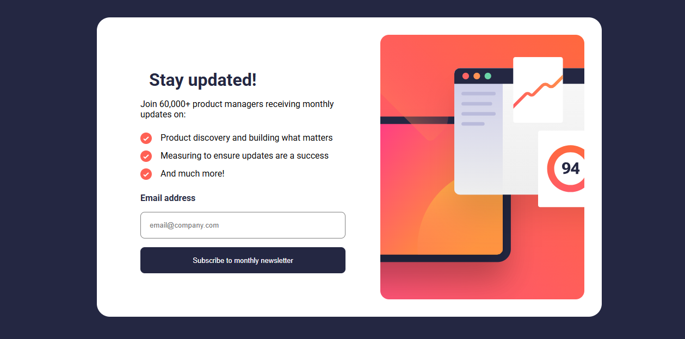
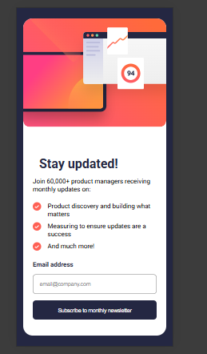
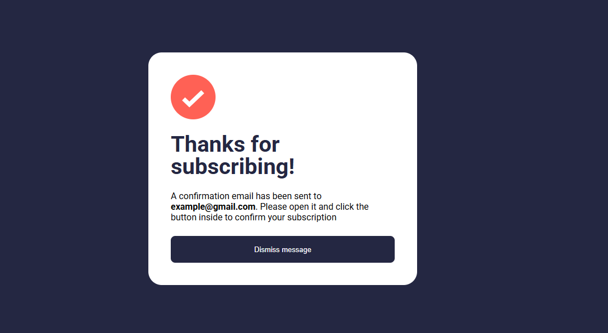
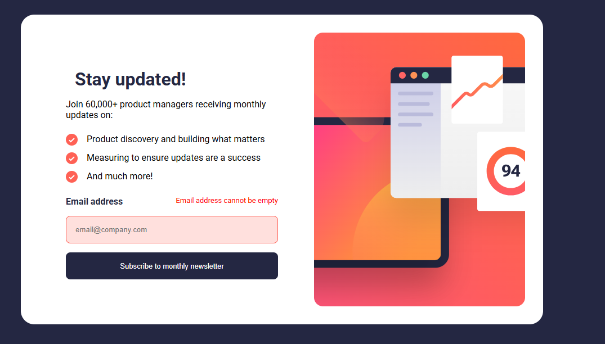

# Frontend Mentor - Newsletter sign-up form with success message solution

This is a solution to the [Newsletter sign-up form with success message challenge on Frontend Mentor](https://www.frontendmentor.io/challenges/newsletter-signup-form-with-success-message-3FC1AZbNrv). Frontend Mentor challenges help you improve your coding skills by building realistic projects. 

## Table of contents

- [Overview](#overview)
  - [The challenge](#the-challenge)
  - [Screenshot](#screenshot)
  - [Links](#links)
- [My process](#my-process)
  - [Built with](#built-with)
  - [What I learned](#what-i-learned)
  - [Continued development](#continued-development)
  - [Useful resources](#useful-resources)
  - [AI Collaboration](#ai-collaboration)
- [Author](#author)
- [Acknowledgments](#acknowledgments)

## Overview

### The challenge

Users should be able to:

- Add their email and submit the form
- See a success message with their email after successfully submitting the form
- See form validation messages if:
  - The field is left empty
  - The email address is not formatted correctly
- View the optimal layout for the interface depending on their device's screen size
- See hover and focus states for all interactive elements on the page

### Screenshot

### Links

- Solution URL: [Solution URL](https://github.com/Aninweze-Chinaza/Newsletter-sign-up-form-with-success-message.git)
- Live Site URL: [live site URL](https://aninweze-chinaza.github.io/Newsletter-sign-up-form-with-success-message/)

## My process

### Built with

- HTML5 
- CSS (Flexbox, mobile-first, rem units)
- JavaScript (DOM manipulation, form validation)

### What I learned

One of the key things I learned while building this project was how to handle form validation in JavaScript. I implemented checks for both empty input and invalid email formats using a regular expression.

I also learned how to manage UI states by toggling between the form and the success message. Initially, I used inline styles, but I later understood that using class-based state management is a cleaner and more scalable approach.

Another important concept I explored was accessibility. I used `aria-live="polite"` to ensure that error messages are announced to screen readers when they change dynamically.

This project also helped me improve my understanding of Flexbox, especially when creating responsive layouts that adapt between mobile and desktop views.

### Continued development

In future projects, I want to focus more on:
- I want to practice organizing my JavaScript using classes or modules instead of global functions.
- Better accessibility practices
- More polished UI/UX (focus states, spacing systems)

### Useful resources

- MDN Web Docs – Helped me understand form validation and DOM manipulation more clearly.
- CSS-Tricks – Useful for improving my understanding of Flexbox and responsive layouts.

### AI Collaboration

I used AI as a learning assistant rather than copying solutions, It helped me debug my form validation logic. it also guided me in structuring my CSS layout.

## Challenges I faced

- Handling empty vs valid email separately
- Switching between form and success state
* Getting desktop layout right - I initially struggled with making the image sit properly in the desktop layout. Even after using flex-direction: row, the image appeared aligned to the top due to Flexbox’s default alignment behavior. I improved the layout by adjusting both alignment (align-items) and image scaling (object-fit), which helped me better understand how Flexbox and image sizing work together.

## Author

- Frontend Mentor - [@Aninweze-Chinaza](https://www.frontendmentor.io/profile/Aninweze-Chinaza)
- Twitter - [@Chinaza_An](https://www.twitter.com/Chinaza_An)

